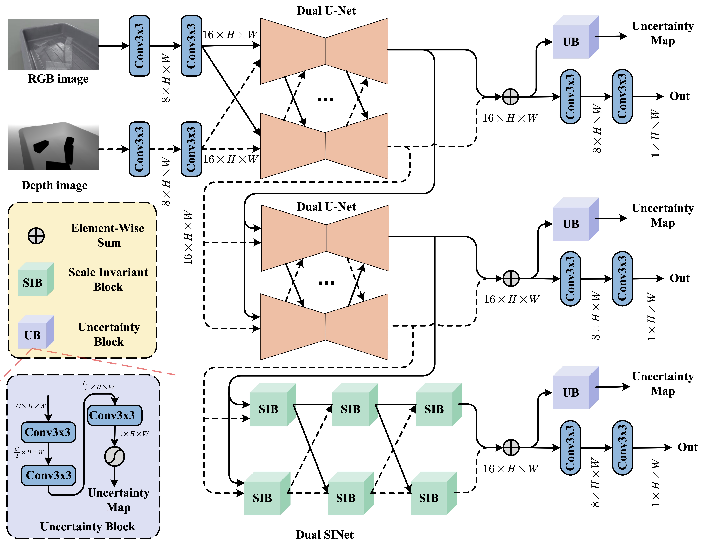

# SpiderNet: Uncertainty-Driven Cross-Guided Network for Depth Completion of Transparent Objects

This repository maintains the official implementation of SpiderNet paper. SpiderNet construct a dual-branch multi-stage network to infer accurate depth information of transparent objects.

Authors: Yutao Hu, Wanliang Wang, Zheng Wang and Yutong Qian



<center>Method Overview</center>

## Installation

The code has been tested on the follows system:

Ubuntu 20.04 / Windows 11

4 NVIDIA 24GB 3090 GPUs / 1NVIDIA 24GB 3090 GPUs

CUDA11.1 / CUDA 11.1

PyTorch 1.8.0 / PyTorch 1.8.0

We provided the installation in Ubuntu as follows:

install system dependencies

```bash
sudo apt-get install libopenexr-dev
```

Conda environment is recommend to install dependencies.

```bash
conda create --name sn python=3.7
conda activate sn
```

Install dependencies.

```bash
git clone https://github.com/hyt1004/SpiderNet.git
cd SpiderNet
conda install pytorch==1.8.0 torchvision==0.9.0 cudatoolkit=11.1 -c pytorch
pip install -r requirements.txt
```

## Dataset Preparation

SpiderNet has been trained on [ClearGrasp Dataset](https://sites.google.com/view/cleargrasp/data)  and  [Omniverse Dataset](https://drive.google.com/drive/folders/1wCB1vZ1F3up5FY5qPjhcfSfgXpAtn31H?usp=sharing).

After you download zip files and unzip them on your local machine, soft link the dataset to the project directory

```
cd SpiderNet
ln -s ${DATASET_ROOT_DIR}/cleargrasp datasets/cleargrasp
ln -s ${DATASET_ROOT_DIR}/omniverse datasets/omniverse
```


 the folder structure should be like

```
${DATASET_ROOT_DIR}
├── cleargrasp
│   ├── cleargrasp-dataset-train
│   ├── cleargrasp-dataset-test-val
├── omniverse
│   ├── train
│   │	├── 20200904
│   │	├── 20200910
```

## Running Code

The file  `config/config.yaml` contains  dataset setting,hyperparameter values.

### Test

We provide pretrained checkpoints at the `checkpoints` directory.  

To run the code, Edit BOTH lines 52-56 and line 73 of the yaml file at `config/config.yaml` to set the dataset config and checkpoint's path:

```yaml
dataset:
  type: 'cleargrasp' # Possible Values: ['cleargrasp']
  inputDir: './dataset/'
  expType: 'val'  # this config is set for cleargrasp dataset, other dataset set null
  objType: 'real'  # this config is set for cleargrasp dataset, other dataset set null
```

```yaml
pathWeightsFile: './checkpoints/best.pth' # Path to the checkpoint to be loaded
```

After that, run the eval script:

```bash
python eval.py -c config/config.yaml
```

## Training

Edit the `config.yaml` file to Set the corresponding hyperparameters.

Start training:

```bash
python train.py -c config/config.yaml
```

